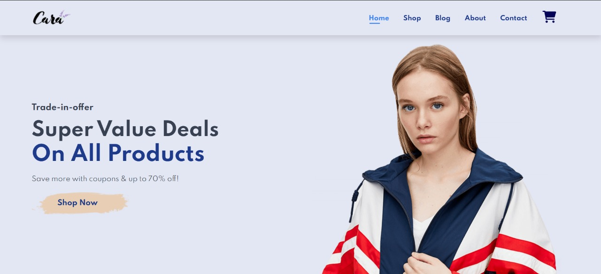

# 🛍️ Cara - Fashion E-Commerce Website

## 📸 Website Preview



*Modern responsive fashion e-commerce website with hero section featuring promotional offers and product showcase*

---

## 📋 Table of Contents
- [📋 Project Overview](#-project-overview)
- [✨ Features](#-features)
- [🛠️ Technologies Used](#️-technologies-used)
- [📁 Project Structure](#-project-structure)
- [🎨 Design Features](#-design-features)
- [🚀 Getting Started](#-getting-started)
- [📱 Pages Overview](#-pages-overview)
- [🎯 Key Features](#-key-features)
- [📸 Screenshots](#-screenshots)
- [🤝 Contributing](#-contributing)
- [📄 License](#-license)
- [🌟 Special Thanks](#-special-thanks)

---

## 📋 Project Overview

**Cara** is a modern, responsive e-commerce fashion website built with HTML and CSS. This project demonstrates a complete online shopping experience with multiple pages and interactive features.

---

## ✨ Features

### 🏠 **Home Page**
- Hero section with call-to-action
- Featured products showcase
- Features highlights (Free Shipping, Online Order, etc.)
- Newsletter subscription
- Responsive design

---

### 🛒 **Shop Page**
- Product catalog with filtering
- Product details and pricing
- Shopping cart functionality
- Product categories

---

### 📝 **Blog Page**
- Fashion blog articles
- Latest trends and news
- Engaging content layout

---

### ℹ️ **About Page**
- Company story and mission
- Team information
- Company values and vision
- Mobile app download section

---

### 📞 **Contact Page**
- Contact form
- Location information
- Customer support details

---

### 🛍️ **Cart Page**
- Shopping cart management
- Product quantity controls
- Checkout process

---

## 🛠️ Technologies Used

- **HTML5** - Semantic markup
- **CSS3** - Styling and animations
- **Font Awesome** - Icons
- **Remix Icons** - Additional icon set

---

## 📁 Project Structure

```
AlhussienHazem-Task-6/
├── index.html          # Home page
├── shop.html          # Shop page
├── blog.html          # Blog page
├── about.html         # About page
├── contact.html       # Contact page
├── cart.html          # Cart page
├── style.css          # Main stylesheet
├── images/            # Image assets
│   ├── logo.png
│   ├── hero.png
│   ├── featured-products-*.jpg
│   ├── blog-*.jpg
│   └── ... (other images)
└── README.md          # This file
```

---

## 🎨 Design Features

- **Responsive Design** - Works on all devices
- **Modern UI/UX** - Clean and intuitive interface
- **Interactive Elements** - Hover effects and animations
- **Professional Layout** - Well-structured content
- **Brand Consistency** - Cohesive design language
---

## 🚀 Getting Started

1. **Clone the repository**
   ```bash
   git clone [repository-url]
   ```

2. **Navigate to the project directory**
   ```bash
   cd AlhussienHazem-Task-6
   ```

3. **Open in your browser**
   - Open `index.html` in your web browser
   - Or use a local server for a better experience

---

## 📱 Pages Overview

| Page | Description | Features |
|------|-------------|----------|
| 🏠 **Home** | Landing page with hero section | Hero banner, features, newsletter |
| 🛒 **Shop** | Product catalog | Product grid, filtering, cart |
| 📝 **Blog** | Fashion blog | Articles, latest trends |
| ℹ️ **About** | Company information | Mission, vision, values |
| 📞 **Contact** | Contact information | Contact form, location |
| 🛍️ **Cart** | Shopping cart | Cart management, checkout |

---

## 🎯 Key Features

- ✅ **Responsive Design** - Mobile-first approach
- ✅ **Interactive Navigation** - Smooth page transitions
- ✅ **Product Showcase** - Featured products display
- ✅ **Shopping Cart** - Add/remove items functionality
- ✅ **Contact Forms** - User interaction forms
- ✅ **Modern Styling** - CSS animations and effects
- ✅ **Cross-browser Compatible** - Works on all major browsers

---

## 🤝 Contributing

This is a learning project showcasing web development skills. Feel free to explore the code and learn from it!

---

## 📄 License

This project is licensed under the MIT License - see the [LICENSE](LICENSE) file for details.

---

## 🙏 Attribution

This project was inspired by the [CARA E-commerce Website](https://github.com/tech2etc/Build-and-Deploy-Ecommerce-Website) by [Tech2etc](https://www.youtube.com/c/Tech2etc).  
The original tutorial served as a foundation for learning and experimentation, and some parts of the layout and structure were adapted during development.

---

## 🌟 Special Thanks

- Font Awesome for icons
- Remix Icons for additional icon set
- All image assets used in this project

---

*Built with ❤️ for learning and showcasing web development skills* 
